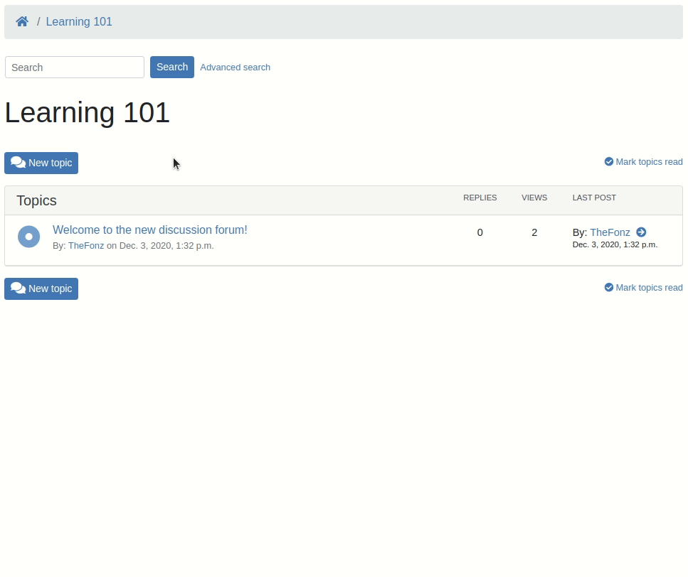

# Ashley, a self-hosted discussion forum for learning

## Overview

`Ashley` is a forum designed to be integrated into `Learning Management Systems` (LMS).

It is a multi-tenant service intended to be operated independently. It can be integrated to any LMS (like [Open edX](https://open.edx.org) or [Moodle](https://moodle.org)), thanks to the [LTI](https://en.wikipedia.org/wiki/Learning_Tools_Interoperability) standard.

`Ashley` is built on top of [Django-machina](https://github.com/ellmetha/django-machina/), a powerful forum engine for `Django`.

## Quick preview

Here is an example integration of Ashley in `Open edX`:




## Contributing

This project is intended to be community-driven, so please, do not hesitate to
get in touch if you have any question related to our implementation or design
decisions.

We try to raise our code quality standards and expect contributors to follow
the recommandations from our
[handbook](https://openfun.gitbooks.io/handbook/content).

## License

This work is released under the MIT License (see [LICENSE](./LICENSE)).

## Getting started

Make sure you have a recent version of Docker and
[Docker Compose](https://docs.docker.com/compose/install) installed on your laptop:

```bash
$ docker -v
  Docker version 18.09.0, build 4d60db4

$ docker-compose --version
  docker-compose version 1.23.2, build 1110ad01
```

⚠️ You may need to run the following commands with `sudo` but this can be avoided by assigning your user to the `docker` group.

## Project bootstrap

The easiest way to start working on the project is to use our `Makefile` :

```bash
$ make bootstrap
```

This command builds the `app` container, installs front-end and back-end dependencies, builds the front-end application and styles, and performs database migrations. It's a good idea to use this command each time you are pulling code from the project repository to avoid dependency-related or migration-related issues.

Now that your Docker services are ready to be used, start the service by running :

```bash
$ make run
```

You should be able to test the forum at [http://localhost:8090/dev/](http://localhost:8090/dev/).
This is the development view that emulates a LTI consumer.

## Django admin

You can access the Django admin site of the forum at [http://localhost:8090/admin/](http://localhost:8090/admin/)

You first need to create a superuser account. 

```bash
$ make superuser
```

## Troubleshooting

### ElasticSearch service out with an Exit 137

```bash
$ docker-compose ps
```
> ashley_elasticsearch_1   /docker-entrypoint.sh elas ...   Exit 137

This is due to a lack of memory.
N.B. for Mac users, the default Docker's configuration is also 2GB which means that Elasticsearch will automatically exit.

To fix this issue, you need to upgrade your default configuration. 


